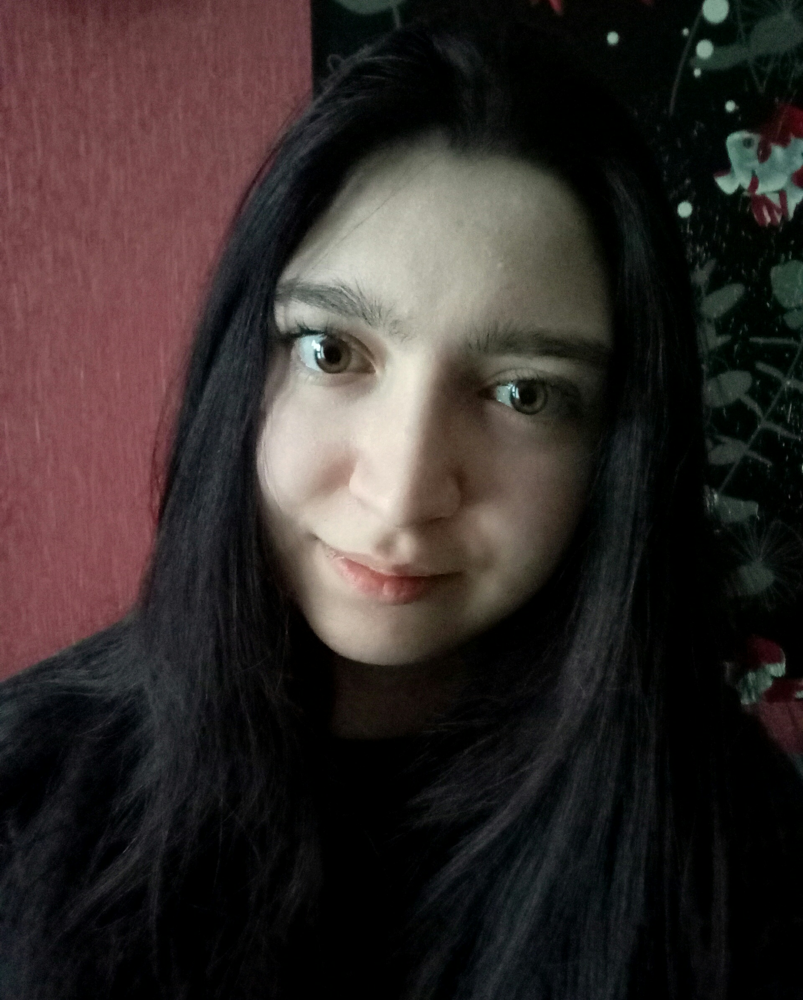

# _Ekaterina Veretennikova_


## Personal details

**Phone:** +375259582878(Life)  
**E-mail:** katishteno@mail.ru  
**Discord:** Ekaterina#8937  
**LinkedIn:** [Ekaterina Veretennikova](https://www.linkedin.com/in/ekaterina-veretennikova-73b22521b/)  
**Telegram:**[Ekaterina Veretennikova](https://t.me/Ekaterina499)  
**GitHub:** [Ekaterina1994](https://github.com/Ekaterina1994)  

---

## Profile

[QUIZ](https://github.com/Ekaterina1994/quiz) is is my latest SPA application that I am working on using technology (REACT, Typescript).  
I also develop my soft skills. This is not the first time I work in a team and I am a group manager. I recently
started a [YouTube channel](https://www.youtube.com/channel/UCEzXFClFND8K9vqYSfb3YAA) where I post a brief description of the work on the project.  
  
I'm ready to discuss any job offers and answer your questions.  
Send me an email at a convenient time for you: katishteno@mail.ru


---

## Hard skills

- React (Router, Redux, Thunk)
- JavaScript (TypeScript)
- HTML, CSS (BEM), SASS, LESS
- Git, GitHub, GitLab
- WebPack, ESLint, Prettier
- Photoshop, Figma, Krita

---

## Soft skills

- Teamplayer
- Communication
- Self-management
- Learn & Improve
- Time management

---

## Code example

Task "Multiples of 3 or 5": 

> Finish the solution so that it returns the sum of all the multiples of 3 or 5 below the number passed in.  Additionally, if the number is negative, return 0 (for languages that do have them).
> Note: If the number is a multiple of both 3 and 5, only count it once.

```
function solution(number){
  let result = 0;
  for (let i = 0; i < number; i++) {
    if(i % 3 === 0 || i % 5 === 0) {
      result += +i;
    }
  }
  return result;
}
```

---

## Experience

| **Years**    | **Job**                                                                                                                                                                                                     |
| ------------ | ----------------------------------------------------------------------------------------------------------------------------------------------------------------------------------------------------------- |
| 2018-2020    | Assistant director of "Information Exchange Institute" in the Prague, Czech Republic |

---

## Main achievement

1. Organized international creative competition (**_more than 250 participants_** from different countries).  
2. Managed all stages of the competition (creation of documentation, message and video-advertising, processing and **_analysis of a large number of materials_**, etc).  
3. Communicated online for about 6 months (including **_resolving conflicts_**) and received **_more than 95% positive feedback_**.  
4. Developed the contest brand (logo, name, corporate colors). I also created exclusive souvenir products (by **_InDesign and CorelDRAW_**).  
5. Received the status of **_"Editor-copywriter of the month"_** regularly (more than three times in a row).

---

## Education

**_IT-education_**

2021-present, RSSchool,  
**specialization:** front end developer

2021-May 2022, “Javacsript: новый уровень” by WAYUP,
**specialization:** front end developer

**_Higher education_**

2011-2016, Belarusian State Technological University,  
**specialization:** publishing, **qualification:** editor-technologist

---

## Languages

1. Russian (Native)
2. Belorussian (Native)
3. English (level B1+)
4. Czech (level A1)
